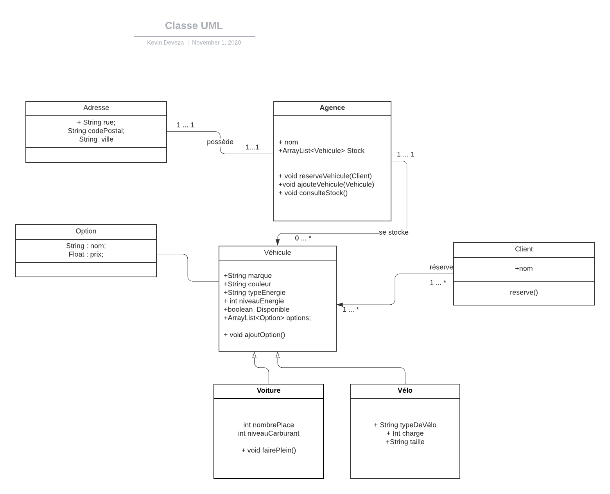

Projet de l'agence basé sur l'UML ci-dessous.

    Enregistrer un véhicule dans un stock
    Réserver un véhicule pour un client
    Consulter les véhicules libres dans une ville
    Gérer la consommation de carburant
    Lever une alerte si un véhicule atteint la réserve de carburant
    Faire le plein du véhicule

